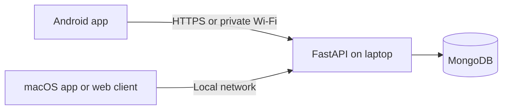

# Beluga Health

## Personal health tracking, medication reminders, and patient records

**Beluga Health** is a student project prototype with a Flutter mobile client, a web client, and a Python API backed by MongoDB. The long-term goal is to help users organize doctor-provided health information and build healthier daily habits.

| Client | Availability |
| --- | --- |
| Android | APK releases will be published on [GitHub Releases](https://github.com/Vish-nath/Beluga/releases). No release is available yet. |
| macOS | Flutter macOS target can be built from source on a Mac; a downloadable Mac package is not currently published. |
| Web | Served by the local FastAPI application. |

> **Prototype notice:** Use synthetic data only. This software is not a medical device and does not diagnose conditions, recommend medication, or replace a qualified clinician.

## What Works Today

- **Accounts:** Register with email and password, sign in with a password, or use Google sign-in when OAuth is configured. Email OTP delivery is not implemented.
- **Personal profile:** View and edit age, gender, blood type, height, weight, location, conditions, appetite, daily routine, family health history, and a profile photo. BMI is calculated from height and weight.
- **Doctor-entered prescriptions:** Save the medicine name, prescribed dose, quantity per intake, clinician instructions, and one or more daily intake times. The app records the instructions provided by the user and does not create or modify prescriptions.
- **Health tracking:** Record steps, active minutes, sleep duration, fasting glucose, and blood pressure.
- **Reminders:** Create meal or routine reminders in the app and get daily local notifications on Android/macOS. Notification actions can mark a medicine as taken or a reminder as done; completion records sync to the laptop server when the action opens the app.
- **Routine guide:** The dashboard displays general, non-clinical prompts and the user's saved routine/appetite notes. It does not use a medical AI model or generate personalized diet treatment.
- **Patient records:** Keep patient demographics, conditions, allergies, medications, and visit notes, including measurements and follow-up dates.
- **MongoDB storage:** FastAPI connects to MongoDB using the `MONGODB_URI` connection string and stores app data in the configured `MONGODB_DATABASE` database. Server settings in the mobile client can be changed and tested.

## Planned Product Scope

The following items describe the intended direction and are **not yet available in the app**:

- Clinically reviewed, personalized diet and daily-routine guidance. The current routine guide is a transparent template, not an AI analysis; blood type, gender, and family history are not used to infer diet or treatment.
- Email OTP delivery and account recovery. Google OAuth and email/password are the available sign-in methods.
- A packaged macOS download. The macOS target can be built from source, but no signed Mac installer is published.

## Architecture



The API server and MongoDB must be reachable while clients use the app. A mobile device on the same Wi-Fi network connects to the API server using the laptop's private IPv4 address.

## Run the Server

From the repository root on Windows PowerShell:

```powershell
py -m venv .venv
.venv\Scripts\Activate.ps1
py -m pip install -r requirements.txt
Copy-Item .env.example .env
notepad .env
py scripts/inspect_and_setup_db.py
py scripts/start_server.py
```

Put your MongoDB connection string in `.env` as `MONGODB_URI`. The database name in the URI is used when present; otherwise the API uses `beluga`. Set `MONGODB_DATABASE` only when you want to override that choice. The tracked `.env.example` contains placeholders only; `.env` is ignored by Git. For MongoDB Atlas, use its connection string and ensure the API server's IP is allowed by the cluster's network access rules. For a local MongoDB server, a URI such as `mongodb://localhost:27017` works. The inspection command verifies the connection and creates the required indexes.

The API is available at `http://<laptop-ip>:8000`; the mobile API base URL ends in `/api`. To find the laptop's address, run `ipconfig`. Connect the phone and laptop to the same private Wi-Fi, then set the APK's **Server Settings** to a URL such as `http://192.168.1.20:8000/api`. Allow Python through Windows Firewall on private networks if prompted. Existing data in the old SQLite file is not migrated automatically; the app now reads and writes MongoDB.

For Google sign-in, configure a Google OAuth **Web client ID** in Google Cloud. Set the same value in `GOOGLE_CLIENT_ID` on the laptop server and `GOOGLE_SERVER_CLIENT_ID` in the mobile build. On Windows PowerShell, set the server value before launching it:

```powershell
$env:GOOGLE_CLIENT_ID = "YOUR_WEB_CLIENT_ID.apps.googleusercontent.com"
py scripts/start_server.py
```

Also register the Android package name and signing certificate in Google Cloud. Google sign-in is hidden when the APK is built without a client ID. Email OTP delivery is not configured; users can use Google sign-in or email/password.

## Get the Android APK

Visit [GitHub Releases](https://github.com/Vish-nath/Beluga/releases). **There is no published APK at this time.** Once a tagged build succeeds, download `app-release.apk` from its release entry.

To build locally with Flutter:

```powershell
cd mobile
py bootstrap.py
flutter build apk --release --dart-define=API_BASE_URL=http://192.168.1.20:8000/api
```

To enable Google sign-in, also pass `--dart-define=GOOGLE_SERVER_CLIENT_ID=YOUR_WEB_CLIENT_ID`. The APK is written to `mobile/build/app/outputs/flutter-apk/app-release.apk`. Replace the example IP with the server laptop's address.

### Publish a GitHub release

Before publishing, configure **Settings > Secrets and variables > Actions**:

- `API_BASE_URL` variable: a stable HTTPS API URL ending in `/api`.
- `ANDROID_DEBUG_KEYSTORE_BASE64` secret: base64-encoded persistent Android signing keystore. Never commit the keystore or secret.
- `GOOGLE_CLIENT_ID` variable (optional): Google OAuth Web client ID. Set the same ID as `GOOGLE_CLIENT_ID` on the laptop server to enable Google sign-in in the APK.

You can publish in either of these ways:

- Push a version tag:

```sh
git tag v1.1.0
git push origin v1.1.0
```

- Or open **Actions > Android APK release > Run workflow**, select the branch to build, enter a version tag such as `v1.1.0`, and run it. The release is created for the selected commit.

After the workflow succeeds, GitHub attaches `app-release.apk` to the release page. A temporary tunnel URL is not suitable for a published build because it can change.

## Build for macOS

An APK only runs on Android. To build the separate macOS app, use a Mac with Flutter and Xcode installed:

```sh
cd mobile
python3 bootstrap.py
flutter build macos --release --dart-define=API_BASE_URL=http://127.0.0.1:8000/api --dart-define=GOOGLE_SERVER_CLIENT_ID=YOUR_WEB_CLIENT_ID
```

The `127.0.0.1` address is suitable when the API server is running on that same Mac. macOS packaging and signing are not part of the current GitHub release workflow.

## Remote Access and Data Safety

For access outside the laptop's private Wi-Fi, use a stable HTTPS endpoint or a carefully configured tunnel; do not open or forward port `8000` on the router. The server and tunnel must remain online. Network reachability does not make this prototype production-ready.

The administrator can view user profiles, health measurements, reminders, and patient records. Grant administrator access only to a trusted person. The project still needs an independent security and privacy review, account recovery, abuse protection, encrypted backups, and operational monitoring before real health data or public users are appropriate.
