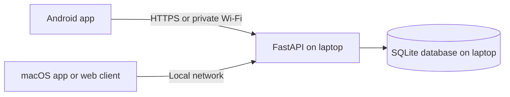

# Beluga Health

## Personal health tracking, medication reminders, and patient records

**Beluga Health** is a student project prototype with a Flutter mobile client, a web client, and a Python API backed by SQLite on a laptop. The long-term goal is to help users organize doctor-provided health information and build healthier daily habits.

| Client | Availability |
| --- | --- |
| Android | APK releases will be published on [GitHub Releases](https://github.com/Vish-nath/Beluga/releases). No release is available yet. |
| macOS | Flutter macOS target can be built from source on a Mac; a downloadable Mac package is not currently published. |
| Web | Served by the local FastAPI application. |

> **Prototype notice:** Use synthetic data only. This software is not a medical device and does not diagnose conditions, recommend medication, or replace a qualified clinician.

## What Works Today

- **Accounts:** Register and sign in with email and password. The mobile client currently does not provide email OTP sign-in.
- **Personal profile:** View and edit name, age, gender, blood type, height, weight, location, health conditions, and medications. BMI is calculated from height and weight.
- **Health tracking:** Record steps, active minutes, sleep duration, fasting glucose, and blood pressure.
- **Reminders:** Create, complete, and remove reminders in the app. These are stored on the server; scheduled operating-system notifications and actions from the notification shade are not implemented yet.
- **Patient records:** Keep patient demographics, conditions, allergies, medications, and visit notes, including measurements and follow-up dates.
- **Laptop-hosted data:** FastAPI serves the clients and stores data in `data/healthbot.sqlite3`. Server settings in the mobile client can be changed and tested.

## Planned Product Scope

The following items describe the intended direction and are **not yet available in the app**:

- Doctor-entered prescriptions with tablet name, prescribed quantity, dosage instructions, and intake schedule. The app should record clinician instructions, not create or change prescriptions.
- More profile context such as appetite, daily routine, family health history, and user-provided location details.
- Personalized healthy meal and daily-routine guidance based on user-entered information. It should not recommend tablets or present generated guidance as a diagnosis or treatment plan.
- Scheduled device notifications for medication and meals, with actions to record whether the user took a tablet or ate a meal.
- Profile photo, email verification/OTP login, and a packaged macOS download.

## Architecture



The laptop must remain powered on and connected while clients use its server. A mobile device on the same Wi-Fi network connects using the laptop's private IPv4 address.

## Run the Server

From the repository root on Windows PowerShell:

```powershell
py -m venv .venv
.venv\Scripts\Activate.ps1
py -m pip install -r requirements.txt
py scripts/start_server.py
```

The API is available at `http://<laptop-ip>:8000`; the mobile API base URL ends in `/api`. To find the laptop's address, run `ipconfig`. Connect the phone and laptop to the same private Wi-Fi, then set the APK's **Server Settings** to a URL such as `http://192.168.1.20:8000/api`. Allow Python through Windows Firewall on private networks if prompted.

## Get the Android APK

Visit [GitHub Releases](https://github.com/Vish-nath/Beluga/releases). **There is no published APK at this time.** Once a tagged build succeeds, download `app-release.apk` from its release entry.

To build locally with Flutter:

```powershell
cd mobile
py bootstrap.py
flutter build apk --release --dart-define=API_BASE_URL=http://192.168.1.20:8000/api
```

The APK is written to `mobile/build/app/outputs/flutter-apk/app-release.apk`. Replace the example IP with the server laptop's address.

### Publish a GitHub release

The Android release workflow runs when a version tag such as `v1.1.0` is pushed. Before tagging, configure **Settings > Secrets and variables > Actions**:

- `API_BASE_URL` variable: a stable HTTPS API URL ending in `/api`.
- `ANDROID_DEBUG_KEYSTORE_BASE64` secret: base64-encoded persistent Android signing keystore. Never commit the keystore or secret.

Then push the tag:

```sh
git tag v1.1.0
git push origin v1.1.0
```

After the workflow succeeds, GitHub attaches `app-release.apk` to the release. A temporary tunnel URL is not suitable for a published build because it can change.

## Build for macOS

An APK only runs on Android. To build the separate macOS app, use a Mac with Flutter and Xcode installed:

```sh
cd mobile
python3 bootstrap.py
flutter build macos --release --dart-define=API_BASE_URL=http://127.0.0.1:8000/api
```

The `127.0.0.1` address is suitable when the API server is running on that same Mac. macOS packaging and signing are not part of the current GitHub release workflow.

## Remote Access and Data Safety

For access outside the laptop's private Wi-Fi, use a stable HTTPS endpoint or a carefully configured tunnel; do not open or forward port `8000` on the router. The server and tunnel must remain online. Network reachability does not make this prototype production-ready.

The administrator can view user profiles, health measurements, reminders, and patient records. Grant administrator access only to a trusted person. The project still needs an independent security and privacy review, account recovery, abuse protection, encrypted backups, and operational monitoring before real health data or public users are appropriate.
