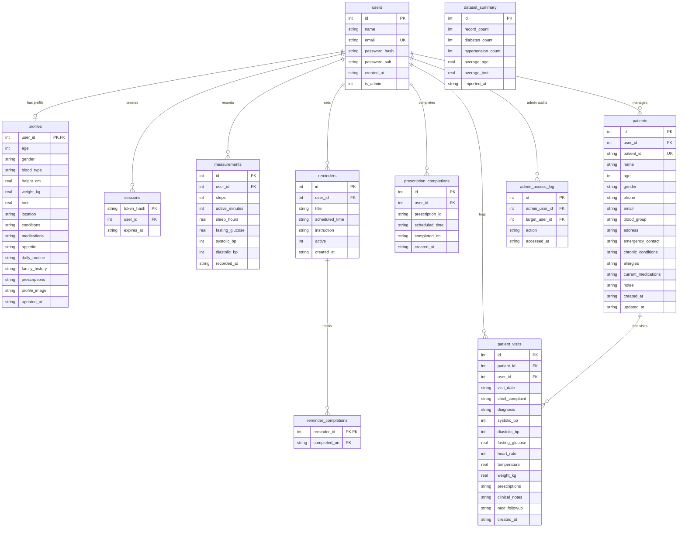

# Beluga Health Database Schema Reference

**Database File:** [`data/healthbot.sqlite3`](file:///c:/Users/vishw/OneDrive/Desktop/Beluga/data/healthbot.sqlite3)  
**Schema SQL:** [`data/schema.sql`](file:///c:/Users/vishw/OneDrive/Desktop/Beluga/data/schema.sql)  
**ORM / Initialization:** [`app/main.py`](file:///c:/Users/vishw/OneDrive/Desktop/Beluga/app/main.py) (`initialize_database()`)

---

## Entity Relationship Diagram

---

## Tables Overview

| Table Name | Description | Rows in DB | Foreign Keys |
| :--- | :--- | :--- | :--- |
| [`users`](#1-users) | User accounts, credentials, and administrator flag | 2 | None |
| [`profiles`](#2-profiles) | Extended health profile, medical history, lifestyle, and prescriptions | 2 | `users(id)` |
| [`sessions`](#3-sessions) | Authentication bearer tokens and session expiration | 2 | `users(id)` |
| [`measurements`](#4-measurements) | Daily biometric and lifestyle logs (BP, glucose, steps, sleep) | 0 | `users(id)` |
| [`reminders`](#5-reminders) | Scheduled user reminders for medications and routines | 0 | `users(id)` |
| [`reminder_completions`](#6-reminder_completions) | Daily adherence tracking for reminders | 0 | `reminders(id)` |
| [`prescription_completions`](#7-prescription_completions) | Dose-level completion tracking for prescriptions | 0 | `users(id)` |
| [`dataset_summary`](#8-dataset_summary) | Aggregate population health statistics (anonymized) | 0 | None (Singleton `id=1`) |
| [`patients`](#9-patients) | Clinical patient registry managed by health workers / admins | 3 | `users(id)` |
| [`patient_visits`](#10-patient_visits) | Clinical encounter history, vitals, prescriptions, and followups | 2 | `patients(id)`, `users(id)` |
| [`admin_access_log`](#11-admin_access_log) | Audit trail of administrative actions on patient/user records | 0 | `users(id)` |

---

## Detailed Schema Definitions

### 1. `users`
Account credentials and administrator role authorization.
- `id` (`INTEGER PRIMARY KEY AUTOINCREMENT`)
- `name` (`TEXT NOT NULL`): Full name.
- `email` (`TEXT NOT NULL UNIQUE COLLATE NOCASE`): Unique user email.
- `password_hash` (`TEXT NOT NULL`): PBKDF2-HMAC-SHA256 hash.
- `password_salt` (`TEXT NOT NULL`): Random salt (hex).
- `created_at` (`TEXT NOT NULL`): ISO 8601 UTC timestamp.
- `is_admin` (`INTEGER NOT NULL DEFAULT 0`): `1` if administrator, else `0`.

### 2. `profiles`
Personal health details, medical history, lifestyle, and JSON arrays.
- `user_id` (`INTEGER PRIMARY KEY REFERENCES users(id) ON DELETE CASCADE`)
- `age` (`INTEGER`): Age in years.
- `gender` (`TEXT NOT NULL DEFAULT ''`)
- `blood_type` (`TEXT NOT NULL DEFAULT ''`): e.g. `O+`, `A-`, etc.
- `height_cm` (`REAL`): Height in centimeters.
- `weight_kg` (`REAL`): Weight in kilograms.
- `bmi` (`REAL`): Body Mass Index.
- `location` (`TEXT NOT NULL DEFAULT ''`)
- `conditions` (`TEXT NOT NULL DEFAULT '[]'`): JSON list of diagnosed conditions.
- `medications` (`TEXT NOT NULL DEFAULT '[]'`): JSON list of active medications.
- `appetite` (`TEXT NOT NULL DEFAULT ''`): Dietary notes / appetite level.
- `daily_routine` (`TEXT NOT NULL DEFAULT ''`): Lifestyle routine details.
- `family_history` (`TEXT NOT NULL DEFAULT ''`): Hereditary medical background.
- `prescriptions` (`TEXT NOT NULL DEFAULT '[]'`): JSON list of active prescription objects.
- `profile_image` (`TEXT NOT NULL DEFAULT ''`): Data URI or URL to avatar.
- `updated_at` (`TEXT NOT NULL`): ISO 8601 timestamp.

### 3. `sessions`
Authentication sessions for active tokens.
- `token_hash` (`TEXT PRIMARY KEY`): SHA-256 hash of the bearer token.
- `user_id` (`INTEGER NOT NULL REFERENCES users(id) ON DELETE CASCADE`)
- `expires_at` (`TEXT NOT NULL`): ISO 8601 UTC timestamp.

### 4. `measurements`
Time-series biometric measurements.
- `id` (`INTEGER PRIMARY KEY AUTOINCREMENT`)
- `user_id` (`INTEGER NOT NULL REFERENCES users(id) ON DELETE CASCADE`)
- `steps` (`INTEGER`)
- `active_minutes` (`INTEGER`)
- `sleep_hours` (`REAL`)
- `fasting_glucose` (`REAL`)
- `systolic_bp` (`INTEGER`)
- `diastolic_bp` (`INTEGER`)
- `recorded_at` (`TEXT NOT NULL`)

### 5. `reminders`
Configured medication and health routine alerts.
- `id` (`INTEGER PRIMARY KEY AUTOINCREMENT`)
- `user_id` (`INTEGER NOT NULL REFERENCES users(id) ON DELETE CASCADE`)
- `title` (`TEXT NOT NULL`)
- `scheduled_time` (`TEXT NOT NULL`): Time string (e.g. `08:00`).
- `instruction` (`TEXT NOT NULL DEFAULT ''`)
- `active` (`INTEGER NOT NULL DEFAULT 1`)
- `created_at` (`TEXT NOT NULL`)

### 6. `reminder_completions`
Tracks completion of reminders per calendar day.
- `reminder_id` (`INTEGER NOT NULL REFERENCES reminders(id) ON DELETE CASCADE`)
- `completed_on` (`TEXT NOT NULL`): Date formatted `YYYY-MM-DD`.
- `PRIMARY KEY (reminder_id, completed_on)`

### 7. `prescription_completions`
Tracks prescription dose intake per scheduled slot.
- `id` (`INTEGER PRIMARY KEY AUTOINCREMENT`)
- `user_id` (`INTEGER NOT NULL REFERENCES users(id) ON DELETE CASCADE`)
- `prescription_id` (`TEXT NOT NULL`)
- `scheduled_time` (`TEXT NOT NULL`)
- `completed_on` (`TEXT NOT NULL`)
- `created_at` (`TEXT NOT NULL`)
- `UNIQUE(user_id, prescription_id, scheduled_time, completed_on)`

### 8. `dataset_summary`
Singleton row holding aggregate population health statistics.
- `id` (`INTEGER PRIMARY KEY CHECK (id = 1)`)
- `record_count` (`INTEGER NOT NULL`)
- `diabetes_count` (`INTEGER NOT NULL`)
- `hypertension_count` (`INTEGER NOT NULL`)
- `average_age` (`REAL NOT NULL`)
- `average_bmi` (`REAL NOT NULL`)
- `imported_at` (`TEXT NOT NULL`)

### 9. `patients`
Clinical patient records managed by health workers.
- `id` (`INTEGER PRIMARY KEY AUTOINCREMENT`)
- `user_id` (`INTEGER NOT NULL REFERENCES users(id) ON DELETE CASCADE`): Clinician / manager user ID.
- `patient_id` (`TEXT UNIQUE NOT NULL`): Unique patient reference code (e.g., `PAT-001`).
- `name` (`TEXT NOT NULL`)
- `age` (`INTEGER NOT NULL`)
- `gender` (`TEXT NOT NULL DEFAULT ''`)
- `phone` (`TEXT NOT NULL DEFAULT ''`)
- `email` (`TEXT NOT NULL DEFAULT ''`)
- `blood_group` (`TEXT NOT NULL DEFAULT ''`)
- `address` (`TEXT NOT NULL DEFAULT ''`)
- `emergency_contact` (`TEXT NOT NULL DEFAULT ''`)
- `chronic_conditions` (`TEXT NOT NULL DEFAULT '[]'`)
- `allergies` (`TEXT NOT NULL DEFAULT '[]'`)
- `current_medications` (`TEXT NOT NULL DEFAULT '[]'`)
- `notes` (`TEXT NOT NULL DEFAULT ''`)
- `created_at` (`TEXT NOT NULL`)
- `updated_at` (`TEXT NOT NULL`)

### 10. `patient_visits`
Clinical encounter history and consultations.
- `id` (`INTEGER PRIMARY KEY AUTOINCREMENT`)
- `patient_id` (`INTEGER NOT NULL REFERENCES patients(id) ON DELETE CASCADE`)
- `user_id` (`INTEGER NOT NULL REFERENCES users(id) ON DELETE CASCADE`): Attending clinician user ID.
- `visit_date` (`TEXT NOT NULL`)
- `chief_complaint` (`TEXT NOT NULL DEFAULT ''`)
- `diagnosis` (`TEXT NOT NULL DEFAULT ''`)
- `systolic_bp` (`INTEGER`)
- `diastolic_bp` (`INTEGER`)
- `fasting_glucose` (`REAL`)
- `heart_rate` (`INTEGER`)
- `temperature` (`REAL`)
- `weight_kg` (`REAL`)
- `prescriptions` (`TEXT NOT NULL DEFAULT '[]'`)
- `clinical_notes` (`TEXT NOT NULL DEFAULT ''`)
- `next_followup` (`TEXT`)
- `created_at` (`TEXT NOT NULL`)

### 11. `admin_access_log`
Security audit log for administrative actions.
- `id` (`INTEGER PRIMARY KEY AUTOINCREMENT`)
- `admin_user_id` (`INTEGER NOT NULL REFERENCES users(id) ON DELETE CASCADE`)
- `target_user_id` (`INTEGER REFERENCES users(id) ON DELETE SET NULL`)
- `action` (`TEXT NOT NULL`)
- `accessed_at` (`TEXT NOT NULL`)

---

## Indexes

- `idx_patients_user`: `ON patients(user_id)`
- `idx_visits_patient`: `ON patient_visits(patient_id)`
